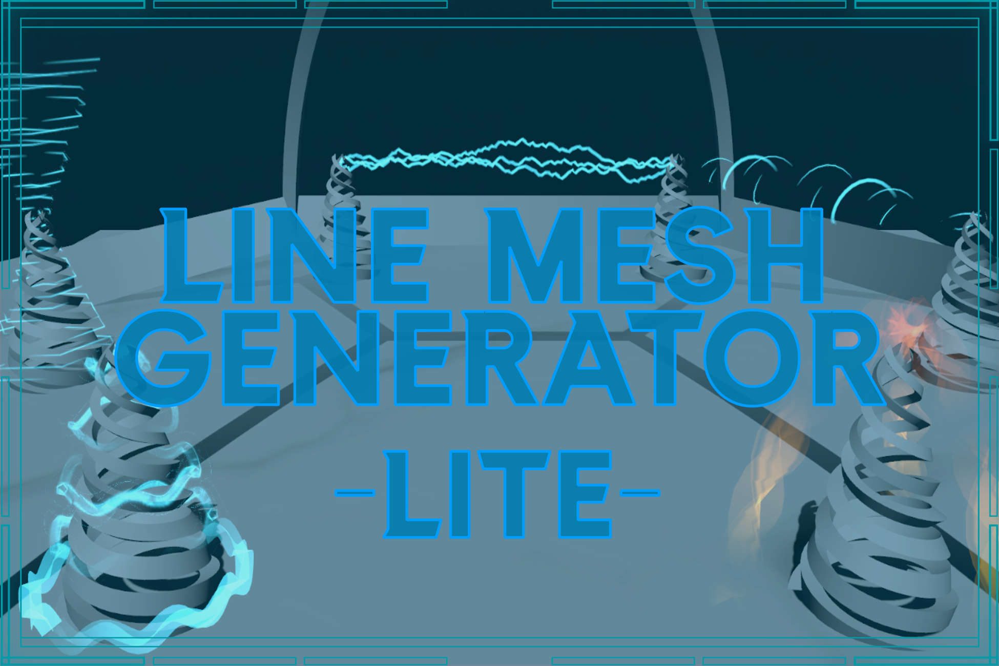

This documentation covers all components from the Line Mesh Generator Lite.
Line Meshes are sometimes called `Swooshmesh` or `SoulerCoaster`.
SoulerCoasters are great for visualizing magic or energy effects.
This package helps you create those.

# Getting Started
Just open the example scene and look at the effects.
For URP and HDRP use **SoulerCoasterExampleSceneURP** for BuiltIn: **SoulerCoasterExampleSceneBuiltIn**.

Video Tutorial on Youtube: https://youtu.be/s4WuQoop-gY

The main Component of this package is the SoulerCoaster.
This part creates your mesh.
The SoulerCoaster creates this mesh from a **LineRenderer**.
The LineRenderer holds the path as well as the width curve.
The SoulerCoaster also uses the parameter `Loop` of the LineRenderer.

To generate the mesh, **right-click** on the SoulerCoaster component and select **generate**.

# Generate the path using one of the utility scripts
The LineRenderer stores the positions and the width curve.

You can fill the LineRenderer positions on your own or use one of the utility scripts of this package:

- BezierLine - Creates a Bezier curve between 3 points.
- CircularLine - Creates a line in a circle with a given axis, arc, and radius.
- CircularSinusLine - Creates a line in a circle with a given axis, radius, and sinusoid height distortion.
- Connector - Creates a line between two or more transforms.
- LightningPath - Generates a random line between two transforms. You can configure strength, frequency, and animation speed. You can call the `animateArc` method to animate changing lightnings.
- EpicycleCircularLine - Creates a path with two circles displacing along a circular base circle.
- EpicycloidLine - Generates an epicycloid path in 2D space. his generates a spirograph-like effect.
- HelixAlongPath - Used to create a helix along an existing path. Can be combined with other path generators
- HelixCircularLine - Generates a helix along a circular path.
- HelixLine - Creates a helix between the given points. You can customize the radius and the rotations.

Every util component has a method called **generate**.
You can execute it by right-clicking on the component.
The util component will fill the line renderer it is attached to. 
You don't need to enable the LineRenderer component.
The SoulerCoaster will only use its positions to render the mesh.

To avoid confusion, I advise you to deactivate the "Use World Space" setting of the LineRenderer.

# Generating a mesh along the path
The SoulerCoaster component has options to modify its behavior.

- Width - General width of the mesh along the LineRenderer
- Skew - Skew the plane by this angle from point to point.
- Use Line Renderer Width Curve - If this is enabled, the mesh's width will follow the LineRenderer Width Curve multiplied by the Width property of the SoulerCoaster.
- Generate Mesh on Enable - The meshes don't get stored by default. To see them in Play Mode you need to generate them on demand. Alternatively, if you want to reuse a Mesh you can right-click on the SoulerCoaster component to save it as an asset.
- Cheap Edges - More performant mesh generation but edges may look odd
- Dont Skew Normals - This creates a mesh with correct normals.
You can't use the SoulerCoaster shader with this option activated. 
The SoulerCoaster shader uses the normal values to implement axis rotation and skewing.
- Type - SoulerCoaster types are explained below.
- New Vertice For Each Edge - Create distinct points for each quad segment. Useful if you have sharp turns. (PolyLine or LineConnector)
- One Sided - Create only one side of the mesh. This can help you if want to light transparent textures.
- Prevent Mesh Saving - Generated meshes can consume a lot of storage. This prevents the storing of the mesh into the scene or prefab. There is a small helper script `PreventMeshSaving` that nulls the mesh before saving. After saving the mesh gets generated again.

Only relevant for the SOULERCOASTER_NGON type
- N Gon Count - Set the edge count for the polygon (Minimum of 3)
- Quad Width Factor - Used to extrude the planes of the regular polygon.

After generating the mesh you can animate them using the provided SoulerCoaster shader.

## SoulerCoaster Types
These are the types you can choose from. They all share, that the UV map of all planes is the same.

- VERTICAL_QUAD: Generates a vertical quad plane along the path
- HORIZONTAL_QUAD: Generates a horizontal quad plane along the path
- SOULERCOASTER:  Generates a horizontal and a vertical quad plane along the path
- SOULERCOASTER_N_GON: Generates multiple planes that form a regular polygon in a diameter.
- CUSTOM_PLANE_CONFIGURATION: Create every plane configuration you like.
You can configure the planes through the `Custom Plane Configuration` behaviour.

# Mesh Material
This package contains a shader for animating SoulerCoasters.
Its basic behavior is to scroll over the provided texture.

You can look at the materials used in the ExampleScene for inspiration.

These are the shader parameters:

- MainColor: The starting color for the mesh
- EndColor: The ending color for the mesh. It gets blended with the MainColor along the path.
- texture: Texture used for the mesh. This texture needs to be repeated. You can achieve the best looks by selecting a vertically oriented texture.
- Tiling: Texture Tiling along the mesh. Normally, the Y amount should be higher than the Y amount. 
- xOffset: Offset the texture on the x-axis. Useful if you set an X-Tiling below one or have a de-centered texture.
- gradientOnMeshStart: Enables you to fade out the mesh start
- gradientOnMeshEnd: Enables you to fade out the mesh end
- gradientOnTile: Enables a gradient on each texture tile.
- gradientOnBorder: Used to fade out the edges of the mesh
- speed: Speed by which the shader scrolls over the texture. You can change the direction by making the speed negative.
- axisRotation: This lets you rotate along the path axis over time.
- skew: This lets you twist the mesh along the path.
- sideBySide: The generated meshes have two UV channels. The second contains a UV map where each plane has its own space. Useful with the SOULERCASTER_N_GON type.
- particleSupport: This deactivates the following features: color, axisRotation, and skew. That enables you to use the mesh in a ParticleSystem.
- repeatTexture: Doesn't repeat the texture on tiling. Useful for projectiles. Beware that the texture is clamped instead (repeats the last pixel on the sides).

# Spline Support
Splines are a package to edit curves in the Unity Editor. The package supports Unity Editors since version 22.
If you want to use the SoulerCoaster component to generate a mesh along a Spline, you can unpack the unitypackage in:
`/soulercoaster/scripts/spline/splinesupport.unitypackage`.
This adds the script `SplineSampler`.
You can use this script to sample a LineRenderer path along the Spline.
You can use this LineRenderer to generate a Mesh.

# Mesh in Particle System
You can also use the generated mesh in a Particle System.
For this, you need to save the mesh as an Asset.
To do that, right-click on the SoulerCoaster component, and click on `saveMesh`.
Then you choose a filename and save the mesh.

You can then use the mesh in a ParticleSystem.
For the particle system, you need to use the **particleSupport** option on the SoulerCaster-shader.
It has no support for rotating along the axis.
It will also ignore the color and skew of the shader.

# Performance
The generated meshes can have a lot of vertices.
If you want to use them repeatedly, you can save them as an asset.
To do that, you can right-click on the SoulerCoaster component and click on `saveMesh`.
You will be prompted to choose a filename.
The MeshFilter will automatically reference your newly created file.
After saving, you need to deactivate the "Generate Mesh on Enable"-parameter.
So the SoulerCoaster doesn't generate a new one on the scene start.

# Mesh Internals
The generated mesh uses some caveats to enable features of the SoulerCoaster shader.
The mesh normals are not usable because they store the path position of a vertex.
The tangent space is used to save the delta-direction of each vertex.
The SoulerCaster shader uses both of these information to implement the axis rotation.

There are two sets of UV maps provided.

The first is the classic SoulerCoaster one.
Each quadplane of the SoulerCoaster has the same UV space.

The second contains all planes side by side in the UV map.

## FAQ
### I don't see a generated mesh
- Check if you have a `MeshRenderer` attached to your GameObject.
- Modify the normal vector slightly. (This happens when the first line segment aligns with the default normal vector.)

### The mesh doesn't align with the LineRenderer
Mesh generation can only work with non-local LineRenderers.
So if you deactivate `Use World Space` it should line up properly.

### My editor is slow and laggy since I use the SoulerCoaster Generator
If you use the `PreventMeshSaving` feature of the SoulerCoaster component you might observe some laggy behaviour.
The script will set all SoulerCoaster `MeshFilter` meshes to null before saving.
After saving it will regenerate all those meshes again and set them properly.
This can cause unresponsiveness.  
You can just disable `Prevent Mesh Saving` and just save the meshes into the scene.

# Known Bugs
## Weird axis rotation in BuiltinRenderPipeline
If you use axisRotation or skew in the builtin render pipeline, it can occur that the mesh rotates in a strange way.
Workaround: Increase the pathGenerators resolution and regenerate the mesh.